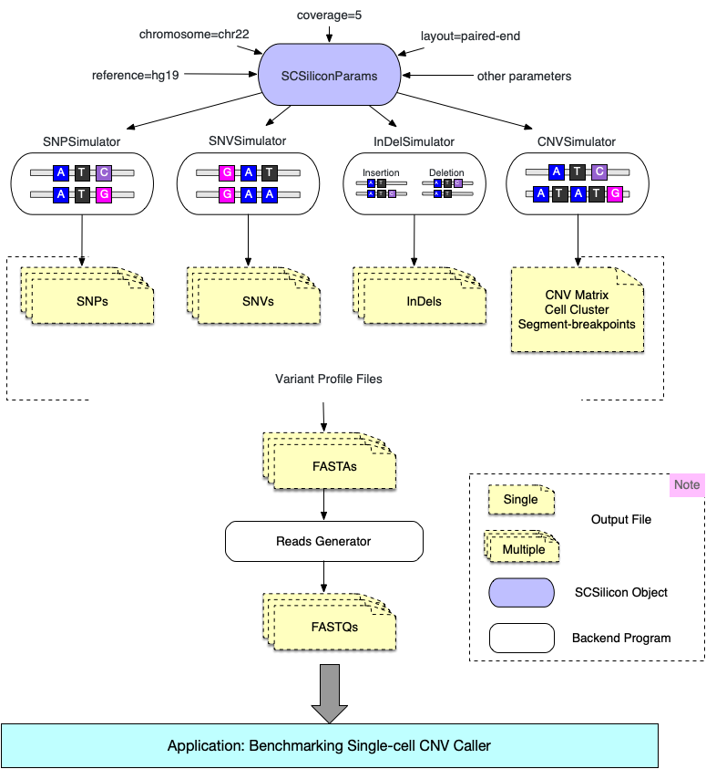

# SCSilicon

SCSilicon is a tool for synthetic single-cell DNA sequencing data generation.



## 1. Pre-requirements
* python3
* numpy>=1.16.1
* pandas>=0.23.4,<0.24
* tasklogger>=0.4.0
* wget>=3.2
* seaborn>=0.11.1
* matplotlib>=3.0.2
* [SCSsim](https://github.com/qasimyu/scssim)


<!-- ### install requirements
```Bash
pip install -r requirements.txt
``` -->
All python packages will be automatically installed when you install SCSilicon if these packages are not included in your python library.

To install SCSsim, please refer to the README of [SCSsim](https://github.com/qasimyu/scssim). 

## 2. Installation

### Installation with pip
To install with pip, run the following from a terminal:
```Bash
pip install scsilicon
```

### Installation from Github
To clone the repository and install manually, run the following from a terminal:
```Bash
git clone https://github.com/xikanfeng2/SCSilicon.git
cd SCSilicon
python setup.py install
```

## 3. Quick start
The following code runs SCSilicon.

```Python
import scsilicon as scs

# create SCSiliconParams object
params = scs.SCSiliconParams()

#download all necessary reference files. Just run once in the first time and remove this line after the first run.
scs.download_ref_data(params)

# simulate snp samples
snp_simulator = scs.SNPSimulator()
snp_simulator.sim_samples(params)

# simulate snv samples
snv_simulator = scs.SNVSimulator()
snv_simulator.sim_samples(params)

# simulate indel samples
indel_simulator = scs.IndelSimulator()
indel_simulator.sim_samples(params)

# simulate cnv samples
cnv_simulator = scs.CNVSimulator()
cnv_simulator.sim_samples(params)
```

## 4. `SCSiliconParams` object
All the general parameters for the SCSilicon simulation are stored in a `SCSiliconParams` object. Let’s create a new one.

```Python
params = scs.SCSiliconParams()
```

### 4.1 All parameters in `SCSiliconParams` object

* `out_dir`: string, optional, default: './'.<br>
    The output directory path
        
* `ref`: string, optional, default: hg19.<br>
    The reference genome version: hg19 or hg38

* `chrom`: string, optional, default: chr22.<br>
    The chromosome number for reads generation:  all or a specific chromosome

* `layout`: string, optional, default: 'SE'.<br>
    The reads laryout: PE or SE (PD for paired-end and SE for single-end)

* `coverage`: int, optional, default: 5.<br>
    The sequencing coverage

* `isize`: int, optional, default: 260.<br>
    The mean insert size for paired-end sequencing

* `threads`: int, optional, default: 1.<br>
    The number of threads to use for reads generation

* `verbose`: int or boolean, optional, default: 1.<br>
    If `True` or `> 0`, print log messages

### 4.2 Getting and setting
If we want to look at the value of parameters, we can extract it using the `get_params` function:

```Python
params.get_params()

# console log: {'out_dir': './', 'ref': 'hg19', 'chrom': 'chr20', 'layout': 'PE', 'coverage': 5, 'isize': 260, 'threads': 10}
```

Alternatively, to give a parameter a new value we can use the `set_params` function:

```Python
paramss.set_params(ref='hg38', chrom='chr22')

# console log: {'out_dir': './', 'ref': 'hg38', 'chrom': 'chr22', 'layout': 'PE', 'coverage': 5, 'isize': 260, 'threads': 10}
```
We can also set parameters directly when we create new `SCSiliconParams` object:

```Python
params = scs.SCSiliconParams(ref='hg38', chrom='chr22')
```

## 5. Simulating reads for SNPs using `SNPSimulator` object
Once we have a set of parameters we are happy with we can use `SNPSimulator` to simulate samples with SNPs in it. 
 ```Python
snp_simulator = scs.SNPSimulator()
snp_simulator.sim_samples(params)
```

### 5.1 All parameters in `SNPSimulator` object

* `cell_no`: int, optional, default: 1.<br>
    The cell number for this simulation

* snp_no : int, optional, default: 1000<br>
    The SNP number of each sample
        

For each sample, `SNPSimulator` will randomly select a total number of SNPs from dbSNP file and `snp_no` parameter can be used to control this total number.

### 5.2 Getting and setting
Similar to `SCSiliconParams`, `SNPSimulator` uses the functions `get_params` and `set_params` to get or set parameters.

### 5.3 Generating FASTAQ sample
`SNPSimulator` object uses the function `sim_samples` to generate FASTQ files for each sample. 
```Python
snp_simulator.sim_samples()
```
If you want to simulate `multiple` samples once, you can use the `cell_no` parameter to contorl this.
```Python
snp_simulator.set_params(cell_no=10)

# or set the parameter when creating the object
snp_simulator = scs.SNPSimulator(cell_no=10)

# generating reads
snp_simulator.sim_samples(params)
```
Above code will simulate 10 samples with FASTQ format once. 

### 5.4 Output files of `sim_samples` function
The `sim_samples` function will generate two output files for each sample in your output directory.

- `sample{1}-snps.txt`: the SNPs included in this sample. This file can be reagrded as the groud truth for SNP detection software. 
- `sample{1}.fq`: the reads data of this sample with FASTQ format.

`{1}` is the sample no., like sample1-snps.txt, sample2-snps.txt.


## 6. Simulating reads for CNVs using `CNVimulator` object
We can use `CNVimulator` to simulate samples with CNVs.

 ```Python
cnv_simulator = scs.CNVSimulator()
cnv_simulator.sim_samples(params)
```

### 6.1 All parameters in `CNVimulator` object

* `cell_no`: int, optional, default: 1.<br>
    The cell number for this simulation

* `bin_len`: int, optional, default: 500000.<br>
    The fixed bin length

* `seg_no`: int, optional, default: 10.<br>
    The segment number for each chromosome

* `cluster_no`: int, optional, default: 1.<br>
    The cell cluster number for multiple sample simulation

* `normal_frac`: float, optional, default: 0.4.<br>
    The fraction of normal cells

* `noise_frac`: float, optional, default: 0.1.<br>
    The noise fraction for cnv matrix

### 6.2 Getting and setting
Similar to `SCSiliconParams`, `CNVimulator` uses the functions `get_params` and `set_params` to get or set parameters.

### 6.3 Generating FASTAQ sample
`CNVimulator` object also uses the function `sim_samples` to generate FASTQ files for each sample. 
```Python
cnv_simulator.sim_samples(params)
```
The `seg_no` parameter can be used to control the segments in each chromosome.
```Python
cnv_simulator.set_params(seg_no=8)

# or set the parameter when creating the object
cnv_simulator = scs.SNPSimulator(seg_no=8)

# generating reads
cnv_simulator.sim_samples(params)
```
Above code will split each chromosome to 8 segments and this is useful for segmentation experiments of single cell CNV detection tools.

If you want to simulate `multiple` samples once, you can use the `cell_no` parameter to contorl this.
```Python
cnv_simulator.set_params(cell_no=10)

# or set the parameter when creating the object
cnv_simulator = scs.SNPSimulator(cell_no=10)

# generating reads
cnv_simulator.sim_samples(params)
```
Above code will simulate 10 samples with FASTQ format once.

For multiple-sample simulation, you can use the `cluster_no` parameter to seperate these samples to several clusters.
```Python
cnv_simulator.set_params(cluster_no=5)

# or set the parameter when creating the object
cnv_simulator = scs.SNPSimulator(cluster_no=10)

# generating reads
cnv_simulator.sim_samples(params)
```
### 6.4 Output files of `sim_samples` function
The `sim_samples` function will generate two output files for each sample in your output directory.

- `cnv.csv`: the CNV matrix with cells as rows and bins as columns. This file can be reagrded as the groud truth for CNV detection software. 
- `segments.csv`:  the segments information for each chromosome. This file can be reagrded as the groud truth for segmentation experiments.
- `clusters.csv`:  the clusters information for each sample. This file can be reagrded as the groud truth for cell cluster experiments.
- `sample{1}.fq`: the reads data of this sample with FASTQ format.

`{1}` is the sample no., like sample1.fq, sample2.fq.


### 6.5 Visualizing the CNV matrix
`CNVimulator` object has the funciton `visualize_cnv_matrix` to draw the heatmap graph for the cnv matrix.
```Python
cnv_simulator.visualize_cnv_matrix(out_prefix)
```
This function will save the heatmap with pdf format to the file named as `out_prefix.pdf`. One example of cnv heatmap graph is shown below:


## 7. Simulating reads for SNVs using `SNVSimulator` object
Once we have a set of parameters we are happy with we can use `SNVSimulator` to simulate samples with SNVs in it. 
 ```Python
snv_simulator = scs.SNVSimulator()
snv_simulator.sim_samples(params)
```
### 7.1 All parameters in `SNVSimulator` object

* `cell_no`: int, optional, default: 1.<br>
    The cell number for this simulation

* `snv_no`: int, optional, default: 1000<br>
    The SNV number of each sample

        

## 8. Simulating reads for Indels using `IndelSimulator` object
Once we have a set of parameters we are happy with we can use `IndelSimulator` to simulate samples with Indels in it. 
 ```Python
indel_simulator = scs.IndelSimulator()
indel_simulator.sim_samples(params)
```
### 8.1 All parameters in `IndelSimulator` object

* `cell_no`: int, optional, default: 1.<br>
    The cell number for this simulation

* `in_no`: int, optional, default: 1000<br>
    The insertion number of each sample

* `del_no`: int, optional, default: 1000<br>
    The deletion number of each sample

## Cite us
todo

## Help
If you have any questions or require assistance using SCSilicon, please contact us with fxk@nwpu.edu.cn.